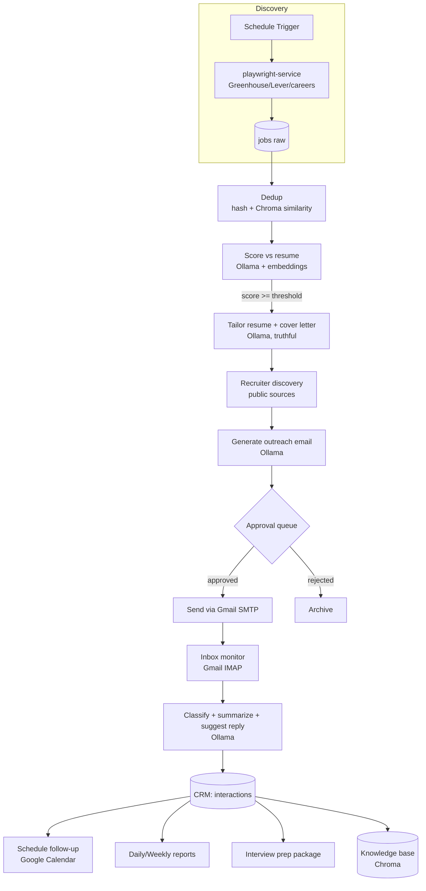
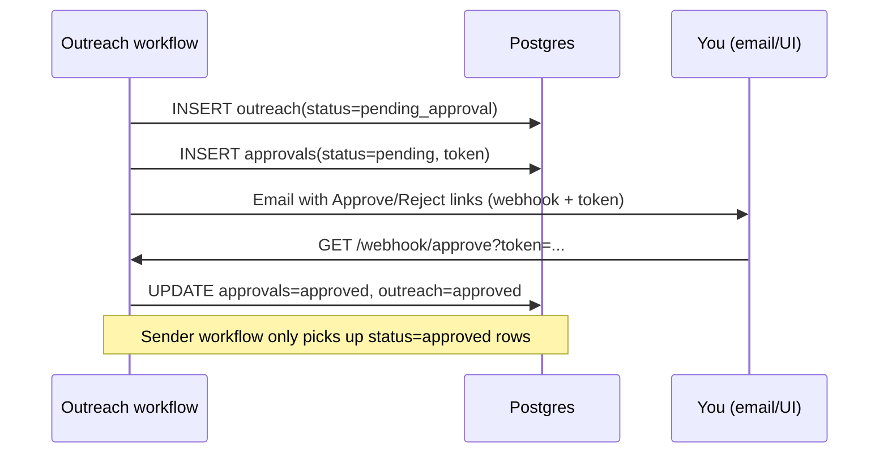

# Architecture

A fully self-hosted, free/open-source **AI Job Search Operating System**. n8n is the
orchestrator; every external capability is a local service. No paid APIs are required.

## Services

| Service | Image | Role |
|---|---|---|
| **n8n** | `n8nio/n8n` | Orchestration, workflows, approval webhooks, scheduling |
| **PostgreSQL** | `postgres:16` | System of record (jobs, applications, CRM, interactions, logs) + n8n's own DB |
| **Ollama** | `ollama/ollama` | Local LLMs — scoring, tailoring, classification, summaries, embeddings |
| **ChromaDB** | `chromadb/chroma` | Vector store — semantic dedup, resume/job similarity, knowledge base |
| **playwright-service** | custom Node | Scraping microservice; prefers free ATS APIs, renders career pages |

Everything runs via `docker compose`. Configuration is entirely env-var driven (`.env`).

## High-level flow

## Module map

| # | Module | Key workflows | Data touched |
|---|---|---|---|
| 0 | Foundation | — | schema, compose, env |
| 1 | Job discovery | `01-discovery` | `jobs`, `companies` |
| 2 | Dedup + embeddings | `02-dedup`, `00-shared/embed` | `jobs`, Chroma `jobs` |
| 3 | Score + tailor + cover letter | `03-score`, `03-tailor` | `job_scores`, `applications` |
| 4 | Recruiter + outreach + approval | `04-recruiter`, `04-outreach`, `04-approval` | `recruiters`, `outreach`, `approvals` |
| 5 | Inbox + classify + CRM + follow-up | `05-inbox`, `05-followup` | `interactions`, `followups` |
| 6 | Reports + interview prep + KB | `06-reports`, `06-interview`, `06-kb` | `reports`, `interview_prep`, Chroma `knowledge_base` |

## Design principles

- **Human-in-the-loop for anything outbound.** No email is sent without an explicit
  approval row transitioning `pending → approved`. Enforced in the DB (`outreach.status`)
  and the workflow, never bypassable by a single node.
- **Truthful tailoring.** The tailoring prompt may reorder, emphasize, and rephrase
  content from the master resume but is constrained never to invent experience. The
  master `resumes.raw_text` is the only allowed source of facts.
- **Idempotency.** `jobs.content_hash` and `interactions.message_id` carry unique
  constraints so re-running discovery or inbox polls never duplicates rows.
- **Respectful scraping.** Per-host delay + global concurrency cap + robots.txt gate in
  `playwright-service`; official ATS APIs preferred over browser rendering.
- **Reusable sub-workflows.** Cross-cutting helpers (Ollama call, Chroma upsert/query,
  structured log, error handler) live in `n8n/workflows/00-shared` and are invoked via
  the *Execute Workflow* node so logic is defined once.
- **Observability.** Every workflow writes structured rows to `app.logs`; the
  playwright-service emits structured JSON to stdout.

## Approval mechanism

